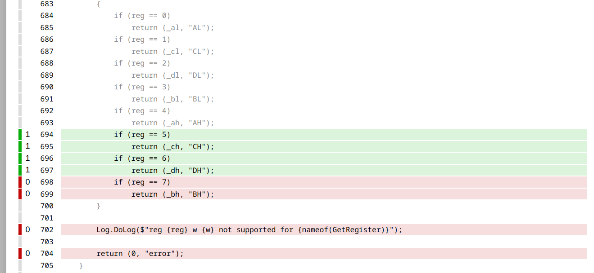

cov-diff
--------

This program calculates the difference between two c# coverage test runs.
That way, you can see what has been tested in the first run, what has been tested in the second run but not in the first run and what has not been tested in either run.

how it works
------------

Run:

* cov-diff.py first-run.xml second-run.xml difference.xml

Indeed, you need to convert the .coverage-files to xml first ( dotnet-coverage merge -o _coverage.xml_ -f xml _mytest.coverage_ ).

difference.xml can then be converted to a report using the regular "ReportGenerator"-tool (https://reportgenerator.io/).
What has been tested in the first run (e.g. in your unittests) is not colored. What has been tested in the second run but not in the first is green and not tested in both is red.

example
-------

In this example I use the tool to see what I verified to work correctly with unit-tests (without 100% coverage) and what is used in a "real-life"-situation. For example with an pc-emulator.

First I run my unit-tests:

* dotnet-coverage collect "dotnet run -c Release -t cpu\_test.fvh -F -l /dev/null" -o cpu-test\_fvh.coverage

Then I run something else, with the idea that it may contain parts that are used in practice but which are not yet tested by the unittests. This way I know which parts of the unittest have priority for enhancements.

* dotnet-coverage collect "dotnet run -c Release -t svardos-disk1.img -F -l /dev/null" -o svardos-disk1.coverage

After that I convert the coverage files to xml-format:

* dotnet-coverage merge -o cpu-test\_fvh.xml -f xml cpu-test\_fvh.coverage
* dotnet-coverage merge -o svardos-disk1.xml -f xml svardos-disk1.coverage

Then I can let my script produce the difference:

* cov-diff.py cpu-test\_fvh.coverage svardos-disk1.xml not-in-unittest.xml

... and let a report of it be generated:

* reportgenerator -reports:not-in-unittest.xml -targetdir:not-in-unittest/ -reporttypes:html

This results in:

In this report you see that line 683-693 have been covered by the unittest. 694-697 is used in the 'svardos-disk1.coverage' and 698-704 not in both tests. Now I know that I need to write tests first for 694-697 as those are used in practice.

Written by Folkert van Heusden <mail@vanheusden.com>

Released under the GPL v3.
